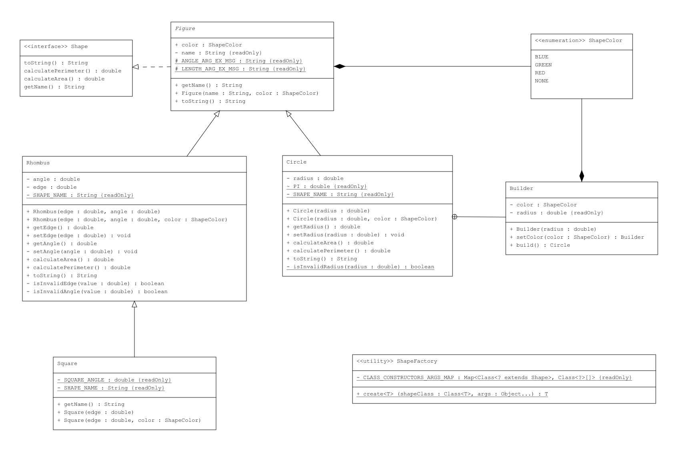

[Home](../index.md) > Java > [OOP](./java_oop.md)

# Java | OOP

## Class Diagram.

Lets take a look at the following example to revisit fundamental object-oriented programming (OOP) concepts.

Geometric Shapes:

- **[ShapeColor](#enum)** - Enum for possible Shape colors.
- **[Shape](#interface)** - Interface for all Shapes.
- **[Figure](#base-class)** - Base class for all Shapes.
  - **[Circle](#class-realization-and-builder-pattern)** - Class for Circle figure.
    - **[Builder](#class-realization-and-builder-pattern)** - Helper class for creating Circles.
  - **[Rhombus](#inheritance)** - Class for Rhombus shape.
    - **[Square](#inheritance)** - Square class as a special case of Rhombus.
- **[ShapeFactory](#polymorphism)** - Shapes Factory.



## Enum.

```java
package Shapes;

/**
 * An enumeration representing shape colors.
 */
public enum ShapeColor {
    NONE,
    RED,
    GREEN,
    BLUE
}
```

## Interface.

```java
package Shapes;

/**
 * An interface representing a basic Shape.
 */
public interface Shape {
    ShapeColor color = ShapeColor.NONE;

    String getName();
    double calculateArea();
    double calculatePerimeter();

    @Override
    String toString();
}
```

## Base Class.

```java
package Shapes;

/**
 * An abstract sealed class for representing a base Shape.
 */
public sealed abstract class Figure implements Shape permits Circle, Rhombus {
    protected static final String LENGTH_ARG_EX_MSG = "%s should be > 0.";
    protected static final String ANGLE_ARG_EX_MSG = "%s should be in range (0°, 180°).";

    private final String name;

    public ShapeColor color;

    public Figure(String name, ShapeColor color) {
        this.name = name;
        this.color = color;
    }

    public String getName() {
        return this.name;
    }

    @Override
    public String toString() {
        return ":: General information ::" +
                System.lineSeparator() +
                String.format("Class: %s.", getClass().getSimpleName()) +
                System.lineSeparator() +
                String.format("Shape: %s.", getName()) +
                System.lineSeparator() +
                String.format("Color: %s.", this.color) +
                System.lineSeparator() +
                String.format("Perimeter: %.2f.", calculatePerimeter()) +
                System.lineSeparator() +
                String.format("Area: %.2f.", calculateArea()) +
                System.lineSeparator();
    }
}
```

## Class Realization and Builder Pattern.

```java
package Shapes;

/**
 * A class representing a Circle.
 */
public final class Circle extends Figure {
    private static final String SHAPE_NAME = "Circle";
    static final double PI = 3.14;

    private double radius;

    public Circle(double radius) {
        this(radius, ShapeColor.NONE);
    }
    public Circle(double radius, ShapeColor color) {
        super(SHAPE_NAME, color);
        setRadius(radius);
    }

    public double getRadius() {
        return this.radius;
    }
    public void setRadius(double radius) {
        if (isInvalidRadius(radius)) {
            String message = String.format(Figure.LENGTH_ARG_EX_MSG, "radius");
            throw new IllegalArgumentException(message);
        }

        this.radius = radius;
    }

    @Override
    public double calculateArea() {
        return Circle.PI * Math.pow(this.radius, 2.0);
    }

    @Override
    public double calculatePerimeter() {
        return 2 * Circle.PI * this.radius;
    }

    @Override
    public String toString() {
        String stringRepresentation = super.toString();

        return stringRepresentation + ":: Details ::" +
                System.lineSeparator() +
                String.format("Radius: %s.", this.radius) +
                System.lineSeparator();
    }

    private static boolean isInvalidRadius(double radius) {
        return radius <= 0;
    }

    /**
     * A builder class for creating instances of {@link Circle}.
     */
    public static class Builder {
        private final double radius;
        private ShapeColor color;

        public Builder(double radius) {
            this.radius = radius;
            this.color = ShapeColor.NONE;
        }

        public Builder setColor(ShapeColor color) {
            this.color = color;
            return this;
        }

        public Circle build() {
            return new Circle(this.radius, this.color);
        }
    }
}
```

## Inheritance

**Rhombus** - base/parent class.

```java
package Shapes;

/**
 * A class representing a Rhombus.
 */
public non-sealed class Rhombus extends Figure {
    private static final String SHAPE_NAME = "Rhombus";

    private double edge;
    private double angle;

    public Rhombus(double edge, double angle) {
        this(edge, angle, ShapeColor.NONE);
    }
    public Rhombus(double edge, double angle, ShapeColor color) {
        super(SHAPE_NAME, color);
        setEdge(edge);
        setAngle(angle);
    }

    public double getEdge() {
        return this.edge;
    }
    public void setEdge(double edge) {
        if (isInvalidEdge(edge)) {
            String message = String.format(Figure.LENGTH_ARG_EX_MSG, "edge");
            throw new IllegalArgumentException(message);
        }

        this.edge = edge;
    }

    public double getAngle() {
        return this.angle;
    }
    private void setAngle(double angle) {
        if (isInvalidAngle(angle)) {
            String message = String.format(Figure.ANGLE_ARG_EX_MSG, "angle");
            throw new IllegalArgumentException(message);
        }

        this.angle = angle;
    }

    @Override
    public double calculateArea() {
        double angleInRadians = Math.toRadians(this.angle);
        return this.edge * this.edge * Math.sin(angleInRadians);
    }

    @Override
    public double calculatePerimeter() {
        return 4 * this.edge;
    }

    @Override
    public String toString() {
        String stringRepresentation = super.toString();

        return stringRepresentation + ":: Details ::" +
                System.lineSeparator() +
                String.format("Edge: %s.", this.edge) +
                System.lineSeparator() +
                String.format("Angle: %s.", this.angle) +
                System.lineSeparator();
    }

    private boolean isInvalidEdge(double value) {
        return value <= 0;
    }

    private boolean isInvalidAngle(double value) {
        return value <= 0 || value >= 180;
    }
}
```

**Square** - subclass/child class derived/inherited from **Rhombus** base/parent class.

```java
package Shapes;

/**
 * A class representing a Square.
 */
public final class Square extends Rhombus {
    private static final String SHAPE_NAME = "Square";
    private static final double SQUARE_ANGLE = 90;

    public Square(double edge) {
        this(edge, ShapeColor.NONE);
    }
    public Square(double edge, ShapeColor color) {
        super(edge, SQUARE_ANGLE, color);
    }

    @Override
    public String getName() {
        return SHAPE_NAME;
    }
}
```

## Polymorphism

**ShapeFactory** - class for creating shapes of any known type.

```java
package Shapes;

import java.lang.reflect.Constructor;
import java.util.HashMap;
import java.util.Map;

/**
 * Shape Factory class for creating Shapes of any type.
 */
public class ShapeFactory {

    // Map with argument list required for certain Shape Class constructor.
    private static final Map<Class<? extends Shape>, Class<?>[]> CLASS_CONSTRUCTORS_ARGS_MAP = new HashMap<>() { {
        put(Circle.class, new Class<?>[]{double.class, ShapeColor.class});
        put(Rhombus.class, new Class<?>[]{double.class, double.class, ShapeColor.class});
        put(Square.class, new Class<?>[]{double.class, ShapeColor.class});
    } };

    public static <T extends Shape> T create(Class<T> shapeClass, Object... args) {
        try {
            Class<?>[] paramTypes = CLASS_CONSTRUCTORS_ARGS_MAP.get(shapeClass);

            if (paramTypes == null) {
                String message = "Class not registered: " + shapeClass.getSimpleName();
                throw new IllegalArgumentException(message);
            }

            Constructor<T> constructor = shapeClass.getDeclaredConstructor(paramTypes);

            return constructor.newInstance(args);
        } catch (Exception e) {
            throw new IllegalArgumentException("Error creating shape", e);
        }
    }
}
```

Usage of **ShapeFactory**.

```java
package Shapes;

public class ShapesApp {
    public static void main(String[] args) {
        // Create shapes array of all known types.
        var allShapes = new Shape[]{
                ShapeFactory.create(Circle.class, 10, ShapeColor.RED),
                ShapeFactory.create(Square.class, 5, ShapeColor.BLUE),
                ShapeFactory.create(Rhombus.class, 6, 45, ShapeColor.GREEN),
        };

        // Print shapes details.
        for (Shape shape : allShapes) {
            System.out.println(shape.toString());
            System.out.println();
        }
    }
}
```

Program output.

```
:: General information ::
Class: Circle.
Shape: Circle.
Color: RED.
Perimeter: 62.80.
Area: 314.00.
:: Details ::
Radius: 10.0.


:: General information ::
Class: Square.
Shape: Square.
Color: BLUE.
Perimeter: 20.00.
Area: 25.00.
:: Details ::
Edge: 5.0.
Angle: 90.0.


:: General information ::
Class: Rhombus.
Shape: Rhombus.
Color: GREEN.
Perimeter: 24.00.
Area: 25.46.
:: Details ::
Edge: 6.0.
Angle: 45.0.
```
